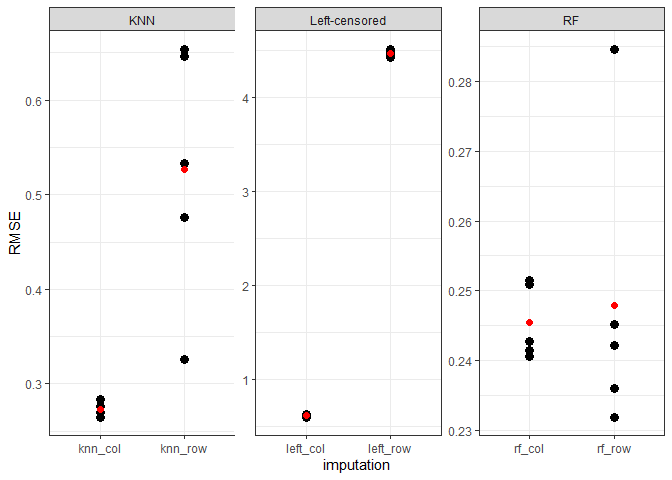

missing value imputation (proteomics)
================
BS
24/02/2023

Evaluation of the three missing value imputation method 1. Random forest
2. KNN 3. Left censored data imputation

all three imputation will be performed row-wise (proteins as rows) and
column-wise (proteins as columns)

<https://rformassspectrometry.github.io/MsCoreUtils/reference/imputation.html>

## load libraries

``` r
library(tidyverse)
library(missForest)
library(impute)
```

## read data and tidy (this is protein groups file from data-independent acquisition (DIA) proteomics)

can be downloaded from ProteomeXchange Consortium via the PRIDE partner
repository, <http://proteomecentral.proteomexchange.org>; dataset id:
PXD040305 (not public yet - 24.02.2023)

``` r
data_raw <- read.delim("proteingroups.txt") %>% 
  select(Genes, starts_with("LFQ")) %>% 
  rename(Variable = Genes) %>% 
  column_to_rownames("Variable") %>% 
  log2 
```

## count missingness in original data

``` r
# count missingness
n_total   <- nrow(data_raw) * ncol(data_raw)
n_missing <- sum(colSums(is.na(data_raw)))

perc_missing <- (n_total/n_missing)
cat(paste0(round(perc_missing), " %"), "of the data is missing")
```

    ## 18 % of the data is missing

## before imputation data will be prefiltered (60 % valid values out of all replicates -12/20)

``` r
data_filtered <-  data_raw %>% 
  mutate(n_valid = 100 - (100 * rowSums(is.na(.))/ncol(data_raw))) %>% 
  filter(n_valid >= 60) %>% 
  select(-n_valid)

# count percentage of missing values after filtering
n_total_afterfiltering   <- nrow(data_filtered) * ncol(data_filtered)
n_missing_afterfiltering <- sum(colSums(is.na(data_filtered)))

perc_missing_afterfiltering <- (n_missing_afterfiltering/n_total_afterfiltering)
cat(paste0(perc_missing_afterfiltering, " %"), "of the data is missing after filtering")
```

    ## 0.0232595062316425 % of the data is missing after filtering

``` r
rm(n_missing, n_total, n_total_afterfiltering, perc_missing, n_missing_afterfiltering)
```

## define functions which perform different types of imputation

### imputation with random forest (RF)

``` r
RF_function <- function(data) {
  data_imputed <- missForest::missForest(as.matrix(data))$ximp
  data_imputed <- data_imputed %>% 
    as.data.frame()
  return(data_imputed)
}
```

### imputation with KNN

``` r
knn_function <- function(data) {
  data_imputed <- impute.knn(as.matrix(data), rng.seed = NULL)$data
  data_imputed <- data_imputed %>% 
    as.data.frame()
  return(data_imputed)
}
```

### left censored missing data imputation (similar to Perseus, or DEP R package)

``` r
impute_left_fn <- function(data, downshift = 1.8, width = 0.3) {
  
   # obtain statistics from the data to build a distribution from which values will be imputed
    valid_data_descriptives <- data %>%
    rownames_to_column("Variable") %>%
    pivot_longer(names_to  = "Bioreplicate", values_to = "Intensity", -Variable) %>%
    group_by(Bioreplicate) %>%
    summarise(mean_valid   = mean(Intensity, na.rm = T),
              median_valid = median(Intensity, na.rm = T),
              sd_valid     = sd(Intensity,   na.rm = T),
              n_valid      = sum(!is.na(Intensity)),
              n_missing    = nrow(data) - n_valid) %>%
    ungroup()
    
    
  # impute missing values
  # imputation
  column_indices <- 1:nrow(valid_data_descriptives)
  random_data <- list()
  
  # makes the list which contains as many elements as the samples are and as many random values as the     
  # missing values are in each sample
  for (i in column_indices) {
    random_data[[i]] <- rnorm(n = valid_data_descriptives$n_missing[i],
                              mean = valid_data_descriptives$median_valid[i] - (downshift * valid_data_descriptives$sd_valid[i]),
                              sd = valid_data_descriptives$sd_valid[i]   * width)
    
  # impute the missing values
    data[is.na(data)[, valid_data_descriptives$Bioreplicate[i]],
              valid_data_descriptives$Bioreplicate[i]] <- random_data[[i]]}
    return(data)
}


leftcensored_function <- function(data) {
  data_imputed <- impute_left_fn(data = data)
  return(data_imputed)
}
```

## function which calculates RMSE

``` r
# n_variable  -> how many genes will be randomly taken from an inital expression data which contains 5000 genes without missing values
# imp_fn      -> which imputation function
# varialbe_in -> variables in rows or in columns (rows = data is learned for each sample, columns=data is learned for each gene)
# perc_na     -> what should be total percantage of missing values in a simulated data (which originally contained only valid values)

RMSE_fn_generic <- function(raw_data=data_raw, n_variable = 4500, imp_fn, variable_in, perc_na = perc_missing_afterfiltering){
  
  
  # select matrix with valid values only
  data_valid <- raw_data %>% 
  drop_na() %>% 
  slice(sample(1:5000, n_variable, replace = F))
 
  # randomly introduce NA values which mimics original data after filtering
  data_simulated_mis <- prodNA(data_valid, noNA = perc_na)
  na_count           <- sum(is.na(data_simulated_mis) == TRUE)

  # variables are rows
  data_variable_in_row <- data_simulated_mis 

  # variables are columns
  data_variable_in_col <- data_simulated_mis %>% 
  t() %>% 
  as.data.frame() 
  
  # case when variables are rows
  if (variable_in == "row") {
    
  # simulated data where missing values are imputed
  data_simulated_imputed <- imp_fn(data=data_variable_in_row) %>% 
      rownames_to_column("Variable") %>% 
      pivot_longer(names_to = "Bioreplicate", values_to = "Intensity_with_imp", -Variable) 
    
  # original data with all valid values
  data_original <- data_valid %>% 
      rownames_to_column("Variable") %>% 
      pivot_longer(names_to = "Bioreplicate", values_to = "Intensity_valid", -Variable) 
    
  # combine two data
  data_combined <- data_simulated_imputed %>% 
      left_join(data_original) 
    
  }

  # case when variables are columns
  if (variable_in == "column") {
    
  # simulated data where missing values are imputed
  data_simulated_imputed <- imp_fn(data=data_variable_in_col) %>% 
      t() %>% 
      as.data.frame() %>% 
      rownames_to_column("Variable") %>% 
      pivot_longer(names_to = "Bioreplicate", values_to = "Intensity_with_imp", -Variable) 
    
  # original data with all valid values
  data_original <- data_valid %>% 
      rownames_to_column("Variable") %>% 
      pivot_longer(names_to = "Bioreplicate", values_to = "Intensity_valid", -Variable) 
    
  # combine two data
  data_combined <- data_simulated_imputed %>% 
      left_join(data_original) 
    
  }
  
  # calculate RMSE
  RMSE <- sqrt(sum((data_combined$Intensity_with_imp - data_combined$Intensity_valid)^2)/na_count)
  return(RMSE)
}
```

## calculate RMSE for all three imputation methods (also row- and column-wise)

``` r
# number of replication
n_iteration <- 5

# Random forest
rmse_rf_row  <- replicate(n_iteration, RMSE_fn_generic(imp_fn = RF_function, variable_in = "row"))
rmse_rf_col  <- replicate(n_iteration, RMSE_fn_generic(imp_fn = RF_function, variable_in = "column"))  

# KNN 
rmse_knn_row <- replicate(n_iteration, RMSE_fn_generic(imp_fn = knn_function, variable_in = "row"))
```

    ## Cluster size 4500 broken into 174 4326 
    ## Done cluster 174 
    ## Cluster size 4326 broken into 2882 1444 
    ## Cluster size 2882 broken into 2812 70 
    ## Cluster size 2812 broken into 2721 91 
    ## Cluster size 2721 broken into 2630 91 
    ## Cluster size 2630 broken into 1123 1507 
    ## Done cluster 1123 
    ## Cluster size 1507 broken into 33 1474 
    ## Done cluster 33 
    ## Done cluster 1474 
    ## Done cluster 1507 
    ## Done cluster 2630 
    ## Done cluster 91 
    ## Done cluster 2721 
    ## Done cluster 91 
    ## Done cluster 2812 
    ## Done cluster 70 
    ## Done cluster 2882 
    ## Done cluster 1444 
    ## Done cluster 4326 
    ## Cluster size 4500 broken into 2732 1768 
    ## Cluster size 2732 broken into 1501 1231 
    ## Cluster size 1501 broken into 1349 152 
    ## Done cluster 1349 
    ## Done cluster 152 
    ## Done cluster 1501 
    ## Done cluster 1231 
    ## Done cluster 2732 
    ## Cluster size 1768 broken into 1215 553 
    ## Done cluster 1215 
    ## Done cluster 553 
    ## Done cluster 1768 
    ## Cluster size 4500 broken into 3006 1494 
    ## Cluster size 3006 broken into 2915 91 
    ## Cluster size 2915 broken into 2836 79 
    ## Cluster size 2836 broken into 1266 1570 
    ## Done cluster 1266 
    ## Cluster size 1570 broken into 85 1485 
    ## Done cluster 85 
    ## Done cluster 1485 
    ## Done cluster 1570 
    ## Done cluster 2836 
    ## Done cluster 79 
    ## Done cluster 2915 
    ## Done cluster 91 
    ## Done cluster 3006 
    ## Done cluster 1494 
    ## Cluster size 4500 broken into 115 4385 
    ## Done cluster 115 
    ## Cluster size 4385 broken into 2793 1592 
    ## Cluster size 2793 broken into 1602 1191 
    ## Cluster size 1602 broken into 1472 130 
    ## Done cluster 1472 
    ## Done cluster 130 
    ## Done cluster 1602 
    ## Done cluster 1191 
    ## Done cluster 2793 
    ## Cluster size 1592 broken into 1573 19 
    ## Cluster size 1573 broken into 1070 503 
    ## Done cluster 1070 
    ## Done cluster 503 
    ## Done cluster 1573 
    ## Done cluster 19 
    ## Done cluster 1592 
    ## Done cluster 4385 
    ## Cluster size 4500 broken into 1143 3357 
    ## Done cluster 1143 
    ## Cluster size 3357 broken into 94 3263 
    ## Done cluster 94 
    ## Cluster size 3263 broken into 1878 1385 
    ## Cluster size 1878 broken into 32 1846 
    ## Done cluster 32 
    ## Cluster size 1846 broken into 846 1000 
    ## Done cluster 846 
    ## Done cluster 1000 
    ## Done cluster 1846 
    ## Done cluster 1878 
    ## Done cluster 1385 
    ## Done cluster 3263 
    ## Done cluster 3357

``` r
rmse_knn_col <- replicate(n_iteration, RMSE_fn_generic(imp_fn = knn_function, variable_in = "column"))  

# left censored data imputation
rmse_left_row <- replicate(n_iteration, RMSE_fn_generic(imp_fn = leftcensored_function, variable_in = "row"))
rmse_left_col <- replicate(n_iteration, RMSE_fn_generic(imp_fn = leftcensored_function, variable_in = "column"))
```

## combine imputation results and visualize

``` r
data.frame(rmse_rf_row, rmse_rf_col, rmse_knn_row, rmse_knn_col, rmse_left_row, rmse_left_col) %>% 
  mutate(iteration = seq_along(1:5)) %>% 
  rename_all(~str_replace(., "rmse_", "")) %>% 
  pivot_longer(names_to = "imputation", values_to = "RMSE", -iteration) %>% 
  mutate(imputation_name = case_when(imputation == "knn_col" | imputation == "knn_row" ~ "KNN",
                                     imputation == "rf_col"  | imputation == "rf_row"   ~ "RF",
                                     imputation == "left_col"| imputation == "left_row"   ~ "Left-censored")) %>% 
ggplot(aes(x=imputation, y = RMSE)) +
  geom_point(size = 3) +
  theme_bw()+
  stat_summary(fun = "mean", colour = "red", size = 2, geom = "point")  +
  facet_wrap(~imputation_name, scales = "free")
```

<!-- -->

## RMSE

``` r
data.frame(rmse_rf_row, rmse_rf_col, rmse_knn_row, rmse_knn_col, rmse_left_row, rmse_left_col) %>% 
  rownames_to_column("row") %>% 
  pivot_longer(names_to = "imputation", values_to = "rmse", -row) %>% 
  group_by(imputation) %>% 
  summarise(mean_rmse = mean(rmse)) %>% 
  arrange(-desc(mean_rmse)) %>% 
  mutate(imputation = str_remove(imputation, "rmse_"))
```

    ## # A tibble: 6 × 2
    ##   imputation mean_rmse
    ##   <chr>          <dbl>
    ## 1 rf_col         0.245
    ## 2 rf_row         0.248
    ## 3 knn_col        0.273
    ## 4 knn_row        0.527
    ## 5 left_col       0.614
    ## 6 left_row       4.48
